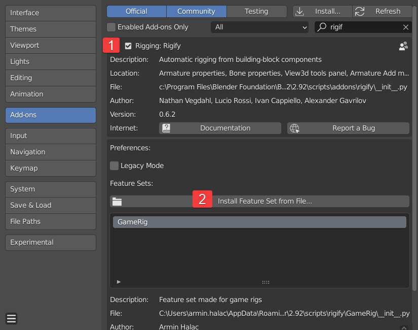
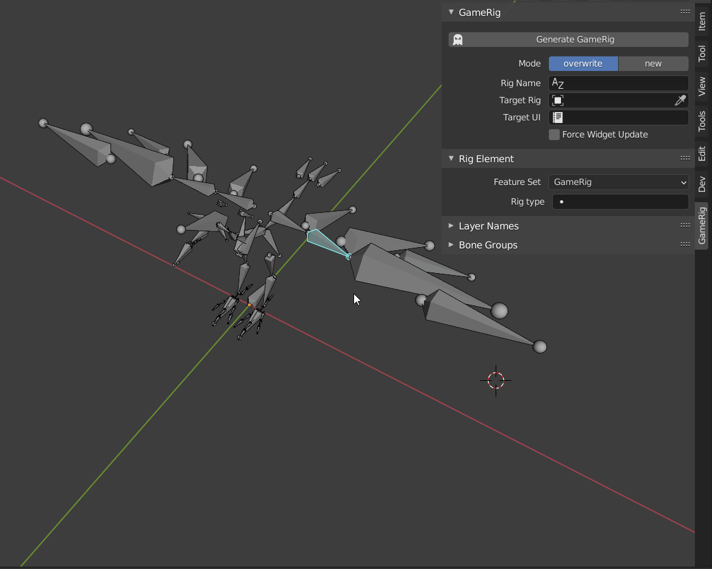

If you use GameRig and it saves you time or money, or if you would like to access a whole lot of rigging tutorials, consider joining my Patreon here:

# GameRig

GameRig is a so called feature set made for creating game engine compatible rigs using Blender's Rigify system.
It has been developed for use with Blender 2.92. Other versions might be compatible as well, this needs further testing.

> ## Installation instructions
> 
> Download the latest release zip file from:
> 
> <https://github.com/Arminando/GameRig/releases>
> 
> Go to Edit > Preferences > Add-ons and enable Rigify (1)
> 
> Click on Install Feature Set From File... and in the file browser select the zip file you downloaded earlier (2)
> 
> 
> 
> That is it already.
> 

> ## Usage instructions
> 
> Exactly the same as regular rigify but make sure to only use the rigs that have the "game." prefix.
> 
> In version 0.0.3 a new UI has been added to the 3D view side panel.
> Some general notes about the UI:
> * You always have access to the Bone Groups and Layer Names panels
> * The GameRig panel is available only in Object and Pose modes. This is where you will be triggering the rig build from
> * The Rig Element panel will show up only in Pose mode and when you have a Bone selected that Rig Type assigned
> * To add rig samples, you need to switch into Edit mode and the GameRig panel will change to provide you with the rig samples list
> 
> 
